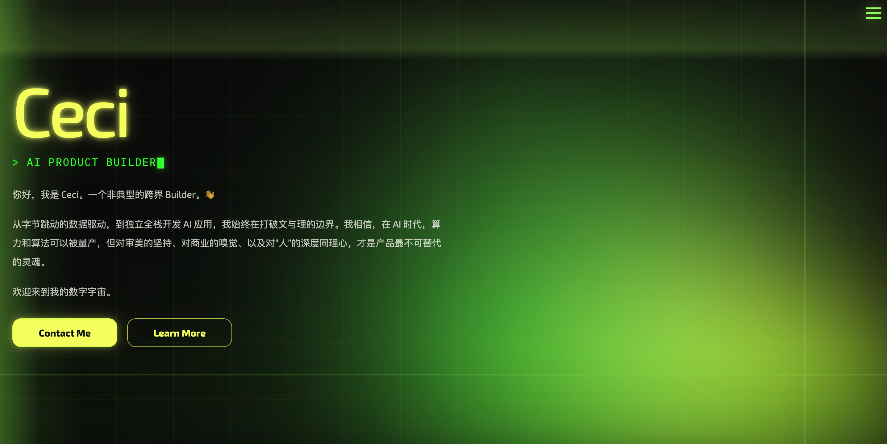

# Ceci Personal Web

一个以霓虹赛博风为主视觉的个人作品集网站，用来展示 Ceci 的 AI 产品能力、内容增长项目、实习经历与个人表达。

## Preview

- 线上仓库：<https://github.com/ceci317/personal-web>
- 本地首页入口：`index.html`

## Highlights

- 霓虹绿 + 黑色基底的 cyberpunk 视觉语言
- 首页动态光影、网格背景与交互式氛围层
- `About / Quote / Projects / Job Experience / Contact` 单页式叙事结构
- 项目区支持视频展示、项目切换与外链直达
- 联系方式区支持图标化入口、微信二维码弹层与彩蛋交互
- 包含多页扩展内容，可进一步沉淀为个人品牌站点矩阵

## Screenshot



## Tech Stack

- HTML5
- CSS3
- Vanilla JavaScript
- Three.js module asset (`assets/three.module.js`)

## Pages

- `index.html`
  - 主作品集首页，包含个人介绍、项目、经历与联系方式
- `ai-builder.html`
  - AI Builder 主题延展页
- `becoming.html`
  - 个人成长与转型表达页
- `beyond-ai.html`
  - AI 之外的兴趣与观察页
- `contact.html`
  - 联系方式独立页

## Project Structure

```text
.
├── index.html
├── style.css
├── script.js
├── ai-builder.html
├── becoming.html
├── beyond-ai.html
├── contact.html
├── assets/
│   ├── *.mp4
│   ├── *.jpg
│   ├── *.png
│   ├── ceci-resume.pdf
│   ├── wechat-qr.jpg
│   └── three.module.js
└── scripts/
    ├── analyze_semantic_heuristic.js
    └── generate_outline_condensed.js
```

## Local Development

直接双击 `index.html` 可以查看静态页面，但更推荐使用本地静态服务预览，避免媒体资源或路由锚点行为受限：

```bash
cd /Users/ceci/Documents/projects_codex
python3 -m http.server 8000
```

然后在浏览器打开：

```text
http://localhost:8000/index.html
```

## Content Notes

- 网站中的图片、视频、二维码、简历与项目链接均为个人作品集素材
- 若要公开分发，建议根据需要进一步确认个人隐私信息与外链内容

## Next Iterations

- 增加更完整的移动端细节打磨
- 为各项目补充更标准的 case study 页面
- 为 GitHub 仓库补充展示截图与版本更新记录
